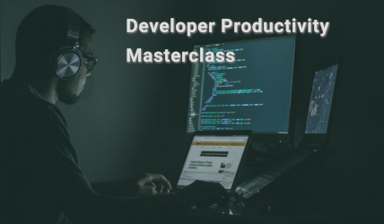

### Hi there 👋

My name is Sebastian and my goal is to help developers getting better at what they're doing.

I'm a self-employed consultant, trainer, author, and conference speaker.
I wrote the book "Architecting Modern Java EE Applications", am participating in open source standardization processes, and helping forming the future standards of Enterprise Java.
Previously, I used to work for IBM as Lead Java Developer Advocate, and I've been recognized as a [Java Champion](https://dev.java/community/jcs/), Oracle Developer Champion, and JavaOne Rockstar.

Another passion of mine is the topic of developer productivity.
I'm the creator and co-founder of [DayCaptain](https://daycaptain.com) 🧑‍✈️ [@DayCaptainApp](https://github.com/DayCaptainApp), a developer-focused tool for prioritizing and managing one's time better.

If you're curious to what I'm doing, you can check out my [YouTube channel 📺](https://www.youtube.com/channel/UCG21GE2Go3vkj7mrs675ysA), [Twitter @DaschnerS 🐦](https://twitter.com/DaschnerS), [blog 🗒](https://blog.sebastian-daschner.com), and [podcast 🎙](https://anchor.fm/effective-developer).

If my content on GitHub has helped you, maybe you want to consider becoming a [sponsor](https://github.com/sponsors/sdaschner) 🥰

And if you want to learn how to become more productive as a developer, I highly recommend to check out my [masterclass video series 💯](https://blog.sebastian-daschner.com/entries/developer-productivity-masterclass).

 

 
 

